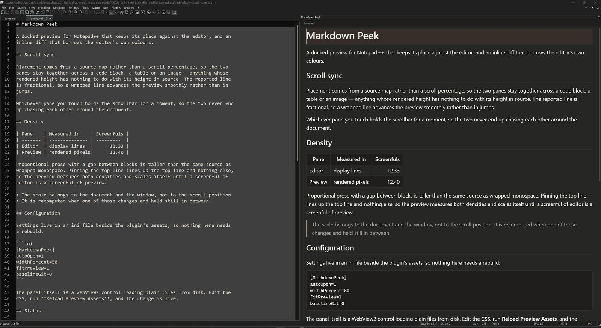
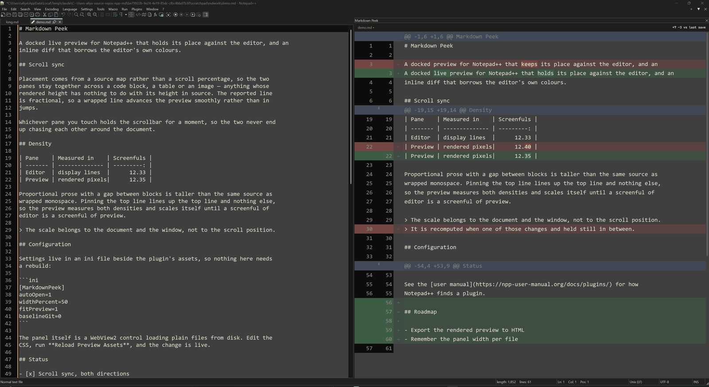

<h1 align="center">Markdown Peek</h1>

<p align="center">
  A docked Markdown preview for Notepad++ that keeps its place against the editor,
  and an inline diff that borrows the editor's own colours.
</p>

<p align="center">
  <a href="https://github.com/ali-yaakub/markdown-peek/actions/workflows/ci.yml"></a>
  <a href="LICENSE"></a>
  
  
</p>



## Why

Notepad++ has Markdown preview plugins already. This one exists for two things the others
do not do: it lines the preview up against the editor properly, and it renders the source
as a diff without leaving the editor.

Lining up is harder than it sounds. Scrolling both panes by percentage drifts the moment a
document contains a code block, a table or an image, because rendered height and source
height stop agreeing. Pinning the top line fixes the top line and nothing else, because
proportional prose with a gap between blocks is taller than the same source as wrapped
monospace — by the foot of a panel the editor is several sections ahead. Markdown Peek
places from a source map and then scales the preview until a screenful of editor is a
screenful of preview, so both panes start and end a page on the same line.

## What it does

- **Preview.** Renders the active Markdown buffer as you type, using markdown-it with GFM
  tables, strikethrough, autolinks and task lists.
- **Scroll sync, both ways.** Scroll the editor and the preview follows; scroll the
  preview and the editor follows. Placement comes from the `data-line` attributes the
  renderer leaves behind, not a scroll percentage, so it stays accurate across code
  blocks, tables and images. The reported line is fractional, so a wrapped line advances
  the preview smoothly rather than in jumps, and updates are throttled rather than
  debounced, so the preview tracks a gesture instead of catching up after it. Whichever
  pane you touch holds the scrollbar for a moment, so the two never chase each other.
- **Scaled to the editor's density.** The preview measures how many screenfuls the editor
  needs for the document, measures its own, and scales itself until the two figures match.
  Recomputed when the document, the window or word wrap changes; held still in between.
  Bounded to 55–115%, so a document of images cannot shrink the text away. `fitPreview=0`
  turns it off.
- **Inline diff.** Renders the source as a unified diff: two line-number gutters, `+`/`−`
  markers, tinted rows, word-level highlights inside edited lines, and `@@` headers naming
  the Markdown section. Distant unchanged regions collapse behind an expander. The
  baseline is the file on disk, or `git show HEAD:<file>`.
- **Your theme, not a copy of it.** The diff's font, background, gutter and every syntax
  colour are read out of Notepad++'s live Scintilla style table. Change theme, or edit a
  style in the Style Configurator, and the panel follows. Only the red and green change
  tints are the plugin's own, and they are translucent so they sit correctly on any
  background.
- **Zoom follows the editor.** Ctrl+scroll in Notepad++ and both panes resize together.
- **A share of the window, not a pixel width.** The panel takes 50% of the editor area and
  holds that share when the window is resized, rather than the fixed pixel width Notepad++
  would otherwise keep. `widthPercent` changes the share; `0` leaves the width alone.
- **Shown or hidden per tab.** Closing the panel is remembered against that buffer, so a
  peek can be closed on one file and left open on another. The record lasts for the
  session and is dropped when a file closes.
- **Opens itself for Markdown.** Activating a `.md` buffer opens the panel.

The preview is styled as a reading surface rather than a second editor: warm ground, one
accent colour, the full width of the panel. The diff is the opposite — it is the editor's
own surface, reproduced.



## Install

There are no releases yet, so build it first. The plugins directory sits under
`Program Files`, so the copy needs an elevated shell.

```powershell
git clone https://github.com/ali-yaakub/markdown-peek.git
cd markdown-peek
.\build.ps1
```

Then, from an elevated PowerShell in the same folder:

```powershell
.\build.ps1 -Install
```

Restart Notepad++. The plugin appears under **Plugins > Markdown Peek**, and on the
toolbar.

To install by hand instead, copy `dist\x64\MarkdownPeek` to
`C:\Program Files\Notepad++\plugins\MarkdownPeek`. The folder name has to match the DLL
name or Notepad++ will not load it.

**Requirements.** Notepad++ 8.8 or later. Windows 10 or 11 with the WebView2 runtime,
which ships with Windows 11 and with any recent Edge on Windows 10.

### Architectures

x64 is built and tested. The build script takes `-Arch x86` and `-Arch arm64`, and the
code is architecture-neutral, but neither is shipped yet: each needs its own
`WebView2LoaderStatic.lib` from the WebView2 SDK, and arm64 additionally needs the MSVC
ARM64 cross toolset. Neither is tested on real hardware, so neither is claimed.

The three lists Plugins Admin reads are independent — 27 of the 196 plugins in the x64
list are absent from the x86 one — so x64 alone is a complete submission rather than a
partial one.

## Opening `.md` files straight into the preview

Two halves, and only the second is the plugin's.

1. **Make Notepad++ the default application for `.md`.** Right-click any `.md` file,
   choose **Open with > Choose another app**, pick Notepad++, and tick **Always use this
   app**. Windows 11 requires this to go through its own dialog; no script can set the
   default for you.
2. **Have the panel open itself.** On by default. Toggle it at
   **Plugins > Markdown Peek > Open Automatically for Markdown**.

## Menu

| Command | Shortcut | Effect |
| --- | --- | --- |
| Markdown Preview | `Ctrl+Alt+M`, or the toolbar button | Show or hide the panel for this tab |
| Inline Diff Mode | `Ctrl+Alt+D` | Switch between preview and unified diff |
| Diff Against Git HEAD | | Baseline is `git show HEAD:<file>` instead of the file on disk |
| Sync to Caret Line | | Track the caret rather than the first visible line |
| Open Automatically for Markdown | | Open the panel when a Markdown buffer is activated |
| Reload Preview Assets | | Re-read the HTML, CSS and JavaScript from disk |
| Open Assets Folder | | Open the editable copy in Explorer |

Double-clicking a block in the preview, or a row in the diff, moves the editor to the line
that produced it.

## Settings

`%APPDATA%\Notepad++\plugins\config\MarkdownPeek\MarkdownPeek.ini`:

```ini
[MarkdownPeek]
autoOpen=1        ; open the panel when a Markdown buffer is activated
diffMode=0        ; start in diff mode rather than preview
syncCaret=0       ; track the caret instead of the first visible line
baselineGit=0     ; 1 diffs against git HEAD, 0 against the file on disk
maxKiB=4096       ; skip rendering above this document size
widthPercent=50   ; share of the editor area the dock takes; 0 leaves it alone
fitPreview=1      ; scale the preview to the editor's density
debugLog=0        ; trace notifications and scroll positions to debug.log
extensions=md;markdown;mdown;mkd;mkdn;mdwn;mdtxt;mdtext;rmd;qmd
```

## Changing how it looks, without rebuilding

The DLL is a thin shell. It owns the window, the WebView and a small message bridge;
everything that decides what the panel looks like is JavaScript and CSS on disk.

On first run the assets are copied to
`%APPDATA%\Notepad++\plugins\config\MarkdownPeek\assets\`, which needs no administrator
rights. Edit them, then run **Reload Preview Assets**.

| File | Responsibility |
| --- | --- |
| `index.html` | Page shell and content security policy |
| `style.css` | The preview palette, and the diff's layout. Diff colours are not here; they arrive at runtime |
| `render.js` | markdown-it configuration and the source-line map |
| `diff.js` | Myers line diff, word diff, style-run expansion, hunk grouping |
| `diffview.js` | The unified diff table |
| `theme.js` | Turns Notepad++'s style table into CSS rules |
| `sync.js` | Source line to pixel offset, and the scroll placement |
| `app.js` | The bridge, both scroll directions, the fit scale, and which of the two views to show |

The dock width and the toolbar icon are native rather than scripted, in `src/Dock.cpp`.

The shipped assets carry a `VERSION` stamp of their own content. When it moves, the
installed copy is refreshed and whatever is replaced is kept beside it as a `.bak`.
Without that, upgrading the plugin left old scripts running against a new DLL.

## Building and testing

Needs the MSVC C++ toolset and the Windows SDK; Visual Studio Build Tools is enough. The
build script finds the toolchain with `vswhere`.

```powershell
.\build.ps1                 # compile and stage into dist\x64\
.\build.ps1 -Arch x86       # or arm64; each gets its own dist folder
.\build.ps1 -Clean          # discard objects first
.\build.ps1 -Install        # also copy into the plugins folder (needs elevation)
.\build.ps1 -Package        # also make the release zip and print its SHA-256
```

Output is a single ~230 KiB DLL. The CRT and the WebView2 loader are linked statically, so
the only dependencies are system libraries and the WebView2 runtime.

`-Package` produces the archive Plugins Admin expects — the DLL at the root of the zip,
the assets beside it — and prints the SHA-256, which is the `id` field of a plugin-list
entry, along with the rest of the entry ready to paste.

```powershell
node test\diff.test.js
```

58 assertions over the diff engine. The load-bearing ones are the reconstruction
properties: dropping every added row must rebuild the baseline exactly, and dropping every
deleted row must rebuild the current document exactly. A 4,000-line document with 45 edits
diffs in about 20 ms, style runs included.

For the panel itself, `node test\serve.js` and then
`http://localhost:8731/test/harness.html`. The harness stands in for the WebView2 host, so
both views, both themes and both scroll directions can be driven in an ordinary browser.
See [CONTRIBUTING.md](CONTRIBUTING.md) for the rest of the loop.

## How it fits together

Notepad++ loads `MarkdownPeek.dll`, which registers a docked child window and hosts a
WebView2 control in it. Two virtual hosts are mapped into the WebView: `mdpeek.local`
serves the plugin's assets, and `mdpeek.doc` serves the edited file's own folder, so
relative images and links resolve without granting the page access to the disk.

The native side posts JSON to the page on six events — buffer activated, text modified
(debounced 180 ms), viewport moved (throttled 16 ms), zoom changed, dark mode changed, and
styles reconfigured. The page posts back short `verb:payload` strings, which is why the
plugin carries no JSON parser.

Styling travels with the document. `SCI_GETSTYLEDTEXTFULL` returns the whole buffer as
character and lexer-style-index pairs in one call, which the plugin run-length encodes and
sends alongside the text. The diff baseline, which is in no editor, is lexed by a hidden
Scintilla created with `NPPM_CREATESCINTILLAHANDLE` and the Lexilla lexer from
`NPPM_CREATELEXER`. Colours for those indices come from `SCI_STYLEGETFORE` and its
siblings on the live view, so they are the user's theme by construction rather than by
imitation.

Notepad++ offers plugins no way to set the width of their own docked panel, so the panel
drives the same message its splitter sends when dragged, `DMM_MOVE_SPLITTER`, addressed to
the `dockingManager` window and re-applied whenever the main window is resized. Every step
of that fails quietly: if the layout is not what is expected, the panel simply keeps
whatever width Notepad++ gave it. The toolbar icon is drawn with GDI at startup rather
than compiled in, which is why the build needs no resource compiler.

### Why the preview is a panel and not the editor

Because Scintilla gives every line the same height. Real in-editor WYSIWYG — a heading
that is actually larger, an image sitting in the text — needs variable line heights, and
Scintilla has none. Every Markdown plugin for Notepad++ that claims WYSIWYG is in fact
rendering into a second surface. This one says so.

## Security model

The panel renders text you are editing, which may have come from anywhere, so it is built
so that a document cannot execute anything.

- The page declares `script-src 'self'`. A `<script>` in a Markdown file has nothing to
  run under.
- The diff view never builds HTML. Rows carry plain text and the view sets it through
  `textContent`, so markup in a document reaches the page as characters.
- The WebView is given exactly two folders through
  `SetVirtualHostNameToFolderMapping`: the plugin's assets and the edited file's own
  directory. It has no other access to the disk.
- Nothing in the plugin makes a network request. markdown-it is vendored, not fetched, and
  the page loads no remote origin. A document that links to one still renders the link;
  clicking it opens your browser, not the panel.
- `git show` is invoked for the diff baseline when `baselineGit=1`, with the file path
  passed as an argument rather than through a shell.

## Licence

GPL-3.0-or-later. See [LICENSE](LICENSE).

This is not a free choice. A Notepad++ plugin has to include the project's plugin
interface headers, which are GPL-3.0-or-later, so anything built against them inherits
that licence. The headers under `include/` carry their original notices.

### Third-party components

| Component | Version | Licence |
| --- | --- | --- |
| [markdown-it](https://github.com/markdown-it/markdown-it) | 14.1.0 | MIT |
| [WebView2 SDK](https://learn.microsoft.com/microsoft-edge/webview2/) | 1.0.3485.44 | Microsoft, redistributable |
| [Notepad++ plugin headers](https://github.com/notepad-plus-plus/notepad-plus-plus) | master | GPL-3.0-or-later |
| [Scintilla headers](https://www.scintilla.org/) | bundled with Notepad++ | HPND |
